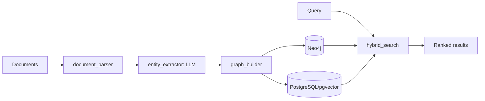

# knowledge-graph-api

> **Engineering report** — builds a knowledge graph from documents (entity
> extraction + graph + vector store) and serves hybrid search. By Nick Yakim.

## 1. Problem & goal
Plain vector search loses relationships ("A acquired B", "X depends on Y").
This service extracts entities/relations from docs, stores them in Neo4j
(graph) + PostgreSQL/pgvector (vectors), and serves **hybrid search** that
blends both signals for more accurate retrieval.

## 2. Architecture



```
 ingest                          query
   │                              │
   ▼                              ▼
document_parser ─▶ entity_extractor ─▶ graph_builder
                                            │
                              ┌─────────────┴─────────────┐
                              ▼                           ▼
                         Neo4j (graph)            PostgreSQL (pgvector)
                              │                           │
                              └───────── hybrid_search ◀──┘
                                            │
                                            ▼
                                       ranked results
```

## 3. Components
- `src/models/neo4j_driver.py` — Neo4j connection.
- `src/models/pg_driver.py` — PostgreSQL/pgvector connection.
- `src/models/schemas.py` — data models.
- `src/routes/ingest.py` / `query.py` / `graph.py` — API surface.
- `src/services/document_parser.py` — extract text from docs.
- `src/services/entity_extractor.py` — LLM entity/relation extraction.
- `src/services/graph_builder.py` — build the graph.
- `src/services/embeddings.py` — vector embeddings.
- `src/services/hybrid_search.py` — combine graph + vector results.
- `src/templates/extraction_prompt.j2` — extraction prompt.

## 4. Run

### API server
```bash
pip install -e .
uvicorn src.main:app --port 8000
```

### Streamlit UI (optional)
The project includes a **Streamlit dashboard** at `ui/app.py` that calls the
existing Python modules directly.

```bash
# Install with UI extras
pip install -e ".[ui]"

# Launch the dashboard
streamlit run ui/app.py --server.port=8501
```

Or run via Docker Compose (UI enabled):
```bash
docker compose --profile ui up -d
# Open http://localhost:8501
```

## 5. Why hybrid?
Vector search finds "semantically similar"; graph traversal finds "directly
connected." Hybrid retrieval returns answers that are both relevant and
relationally grounded — useful for RAG over interconnected knowledge.

## 6. CI
`.github/workflows/ci.yml` — syntax check + pytest, least-privilege, pinned
actions, Dependabot.

## Author
Nick Yakim — [github.com/yakim-nick](https://github.com/yakim-nick)
